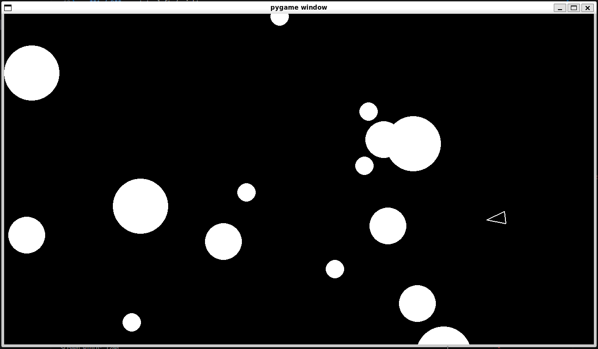

# Asteroids

A classic arcade shooter built with Pygame as part of the [Boot.dev](https://boot.dev) curriculum.



## How to Play

Pilot a ship through an asteroid field. Shoot asteroids to survive. Large asteroids split into smaller ones when hit. Collide with any asteroid and the game ends.

**Controls:**

- **W / S** - thrust forward / backward
- **A / D** - rotate left / right
- **Space** - shoot

## Running the Game

Requires Python 3.12+ and [uv](https://docs.astral.sh/uv/).

```
uv run main.py
```

## Project Structure

| File | Purpose |
|------|---------|
| `main.py` | Game loop, collision detection, sprite group management |
| `player.py` | Ship movement, rotation, and shooting |
| `asteroid.py` | Asteroid behavior and splitting on impact |
| `asteroidfield.py` | Spawns asteroids from screen edges |
| `shot.py` | Bullet movement |
| `circleshape.py` | Base class for all circular game objects |
| `constants.py` | Screen dimensions, speeds, radii, cooldowns |
| `logger.py` | Game state and event logging for debugging |

## On AI Assistance

I built this project by hand. An AI assistant served strictly as a mentor - it asked questions, offered hints, and pointed me toward documentation. It never wrote code for me. Every line in this repository is mine.

The process resembled rubber duck debugging with a duck that talks back. When I got stuck, the AI would ask "What do you expect this to do?" or "Which object has that method?" These questions forced me to reason through problems myself. When I hit a wall, it would show me a minimal example - two or three lines at most - then push me to explain the concept back.

## What I Learned

This project made me quit once. Objects, classes, inheritance, the way Python wires them together - it all felt hostile. I walked away for a long time.

I came back and finished it. That matters more than any specific technique I picked up. Coding and using AI to code are two very different things. When you learn traditionally, you face a harsh reality: programming is not easy, and no tool changes that. AI tools are wonderful at helping you push through - reminding you how the language expects things to be written, asking the right question when you're stuck - but you still have to do the thinking.

Learning to program hurts in a strange, almost metaphysical way. It confronts you with your own confusion, over and over. But fixing the thing that broke you ten minutes ago is deeply rewarding. That tension - the pain and the payoff - is what keeps me going.

## If I Kept Building

I stopped here. The course is done and I'm moving on. But if I returned, I'd add:

- Score tracking and a high-score display
- A main menu screen
- Sound effects
- Asteroid-to-asteroid collisions (bouncing, not passing through)
- A lives system

There is a lot of room to grow a simple asteroid game.

## A Note on `self`

Python requires you to declare `self` as the first parameter of every method. Coming in fresh, this feels redundant. The object already calls the method - why announce it again?

I suspect I'm wrong to find it annoying. A language used by millions of developers for decades keeps `self` explicit for a reason. Explicit beats implicit, as the Zen of Python puts it. Still, the friction is real when you're learning, and I wanted to note it honestly.

## Author

Zoran Spirkovski - [Boot.dev](https://www.boot.dev/u/standardnewspaper73) | [LinkedIn](https://www.linkedin.com/in/zoran-spirkovski/) | [X](https://x.com/SpirkovskiZoran)
